# Commande_afficheur_LCD_par_microbit
Tâches principales la mesure puis l’affichage des variations d’inclinaison de la carte microcontrôleur sur l’écran LCD.

  

L’afficheur LCD en mode 8 bits

**communication micro:bit – afficheur LCD**

Pour établir la communication entre la carte BBC **micro:bit** et un afficheur LCD, nous devons créer une bibliothèque des fonctions de gestion de ce composant.

Un programme sous forme de pseudo-code à traduire en micropython est proposé pour tester cette bibliothèque.

Le code résultant aura pour tâches principales la mesure puis l’affichage des variations d’inclinaison de la carte microcontrôleur sur l’écran LCD.

Ce code source sera téléchargé sur la carte **micro:bit**, puis exécuté.

Rappels: Connexions afficheur LCD – carte BBC micro:bit

- Cmmande en écriture de l’écran LCD
- - écran 2x16 caractères
- - mode 8 bits

- Liaisons :
- - entrée de sélection de registre RS -> pin6
- - entrée de validation E  -> pin7
- - entrée de lecture/écriture (R/W) reliée au GND
- - Bus de données (8 lignes) :
- DB0   DB1   DB2   DB3    DB4    DB5    DB6    DB7
- [pin4, pin3, pin8, pin16, pin15, pin14, pin13, pin12] 
- Fonctions de bibliothèque LCD :
- ecrireSurLeBus(octet)
- envoyerCommande(commande)
- initEcran( )
- afficherCaractere(car)
- afficherMessage(texte)
- afficherValeurDe(nombre)

Commande de l’afficheur LCD par micro:bit

Programme sur la carte micro:bit.

Ce programme mesure les variations d’inclinaison (par le module accelerometer) de la carte **micro:bit**. Les valeurs

d’acquisition sont affichées en temps réel sur l’écran LCD :

- R : prise de **r**oulis (autour de l’axe y)
- T : prise de **t**angage (autour de l’axe x)

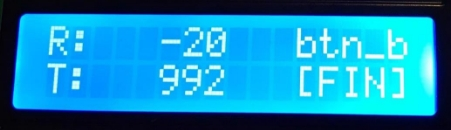

Le programme s’arrête lorsque l’utilisateur appuie sur le bouton-poussoir***button\_b***.

L’accéléromètre fait partie des composants de la carte **micro:bit**. Il permet de mesurer l’inclinaison de la carte microcontrôleur suivant les trois directions (x,y,z). La présentation de la bibliothèque associée à ce capteur est accessible à l’adresse :

Les fonctions à utiliser dans le programme font partie de la liste :

- .accelerometer.get\_x()
- .accelerometer.get\_y()
- .accelerometer.get\_z()
- .accelerometer.get\_values()
- .accelerometer.current\_gesture()

 

**Le module accelerometer de la carte micro:bit **

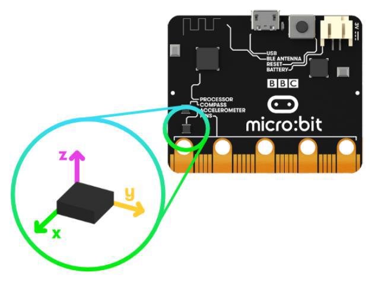

**Travail demandé**

Traduire le pseudo-code suivant en python pour **micro:bit**.

**Programme à implémenter sur la carte micro:bit!**

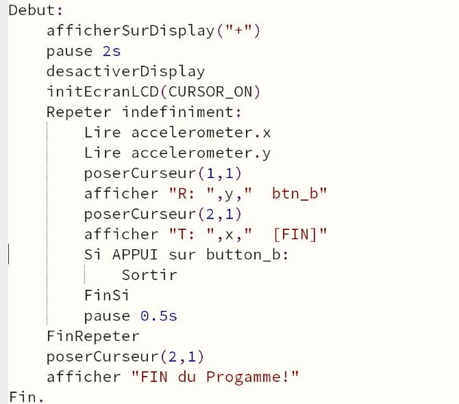

**L’afficheur LCD - Liaisons**

**Bus de données 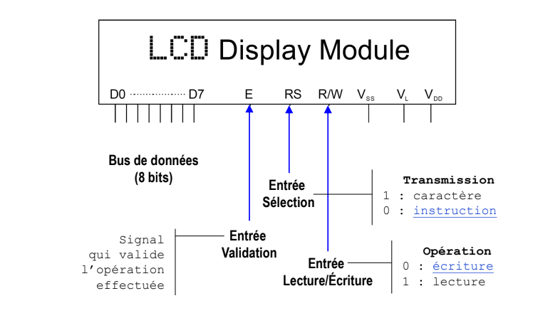
**(8 bits) Entrée  Transmission Sélection** 1 : caractère

0 : instruction

Signal~~  **Entrée**  

qui valide **Validation Opération** l’opération **Entrée**  0 : écriture

effectuée **Lecture/Écriture** 1 : lecture

**Chronogramme : opérations d’écriture**

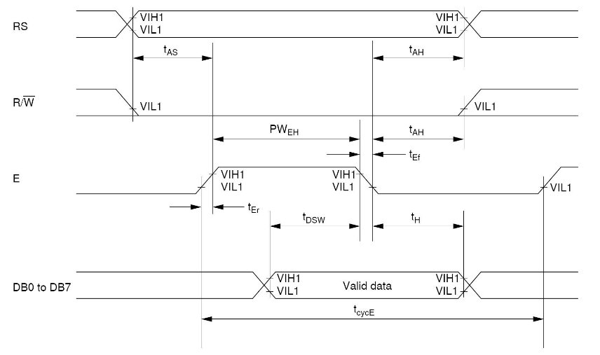

**Opérations d’écriture : Cycles, durées**

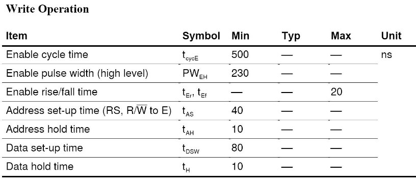

**L’écran LCD – Jeu d’instructions**

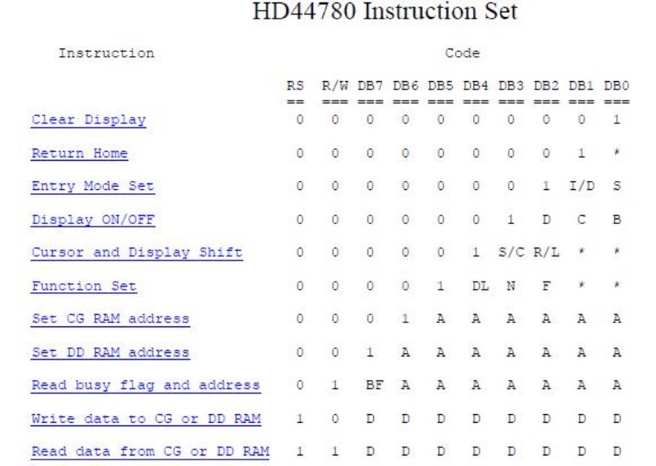

**Clear Display**

Clear  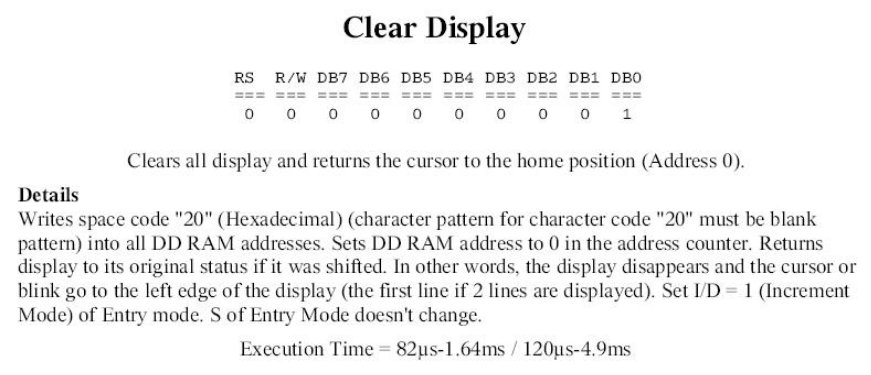Display 

**Display ON/OFF**

**Function Set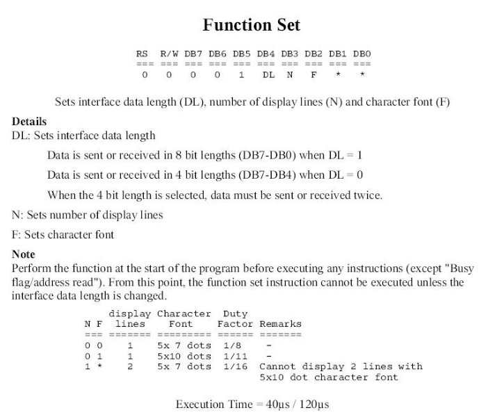**

**Positionner le curseur (ligne, colonne)**

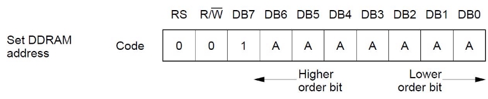

**1ère ligne :**

**2ème ligne :**

**3ème ligne :**

**4ème ligne :**

cmde = 0x80 + (col – 1) cmde = 0xC0 + (col – 1) cmde = 0x90 + (col – 1) cmde = 0xD0 + (col – 1)

 

**Jeu de caractères de l’afficheur LCD**

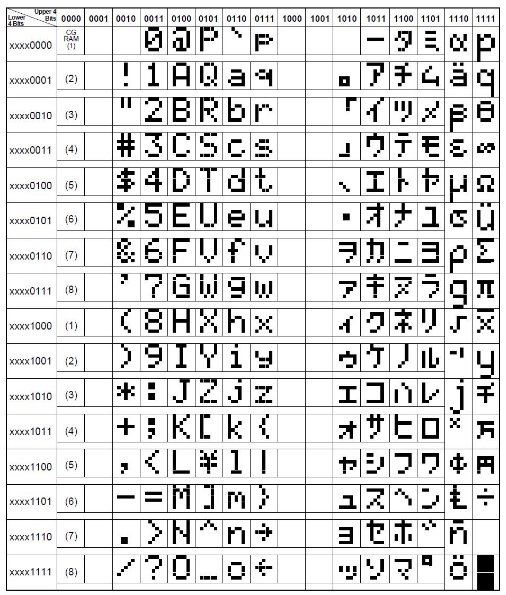

[**Brochage de la carte micro:bit**](https://microbit.org/guide/python/)

